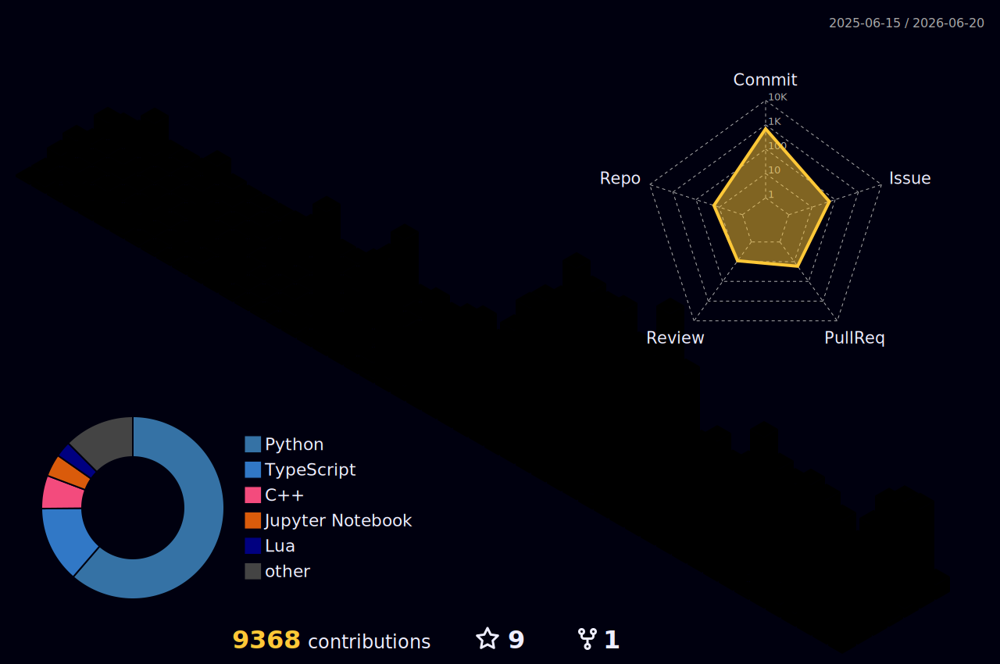

  <h1>Fatih Burak Karagöz</h1>
  
AI/ML & NLP researcher turning ideas into production systems.

  

    <a href="https://karagoz.io">karagoz.io</a> ·
    <a href="https://rota.education">ROTA:::ATLAS</a> ·
    <a href="https://cdli.ai">CDLI.ai</a>
  

---

### Currently building
- **ROTA** — adaptive AI systems for human-centered learning and guidance

---

### GitHub activity
Most of the activity below is infrastructure work, evaluation tooling, and pipeline refactors.  
The graph updates automatically using  
[github-profile-3d-contrib](https://github.com/yoshi389111/github-profile-3d-contrib).

