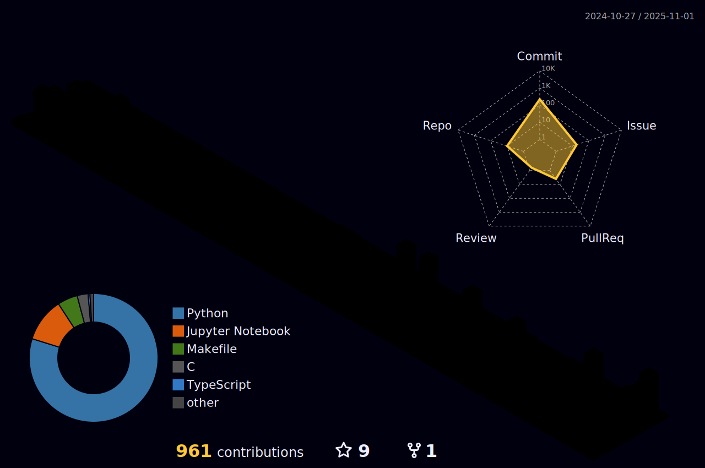

  <h1>Fatih Burak Karagöz</h1>
  
AI/ML & NLP researcher turning ideas into production systems.

  

    <a href="https://karagoz.io">karagoz.io</a> ·
    <a href="https://betterquery.app">betterquery.app</a> ·
    <a href="https://orqel.com">orqel.com</a>
  

---

**Currently building**
- [BetterQuery](https://betterquery.app) — analytics co-pilot that pairs analysts with LLM agents
- [Orqel](https://orqel.com) — adaptive automation for creative operations teams

**Focus areas**
- Retrieval-augmented generation pipelines for knowledge-dense corpora
- Agentic systems that keep researchers, data, and product feedback in sync
- MLOps patterns that make NLP models observable and reliable in production

**Toolbox vibes**
`Python` `PyTorch` `Transformers` `LangChain` `Weights & Biases` `DuckDB` `Prefect`

**What's next**
- Scalable knowledge graphs that mix private and public data streams
- Evaluating “human + model” collaboration patterns in analytics teams

---

**GitHub 3D contributions**

The graph below updates automatically every night. It’s rendered with [github-profile-3d-contrib](https://github.com/yoshi389111/github-profile-3d-contrib).

